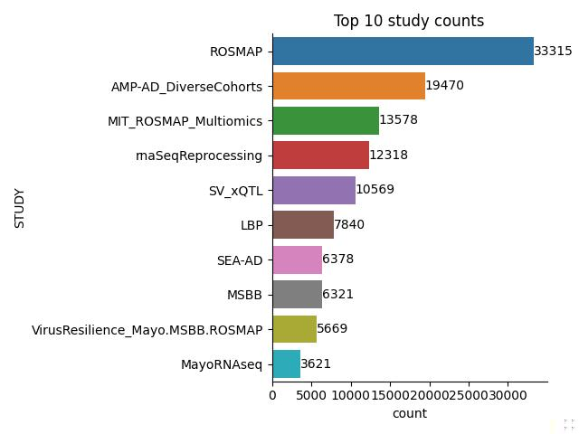

# Portal Analyitics

This repository is my attempt to perform some analysis on the merged raw data from the portals. My goal was to try and find some correlations between variables in the hope of creating some derived or automated annotations.

## Setup
1. Rename the `.env-template` -> `.env`
2. Update the `.env` file with your information.

## Data

`snowflakeData.csv` was taken from the `SAGE.PORTAL_RAW.PORTAL_MERGE` on October 31st, 2023.

### Cleaning

The data was cleaned using `./cleaning.ipynb`. The major work was to clean up the names and differences in spellings for variables like assay. This is ongoing work as I work through the EDA part.

I pulled terms from [OLS4](https://www.ebi.ac.uk/ols4) as a cross reference for variables like assay types and file formats using `./ontologyScraper.py` in the hope of matching our annotations with a known 3rd party ontology source.

I also derived some file formats by splitting by ".". This causes the zip files to be a larger portion of the data so further cleanup to remove zip extensions to look at the underlying file types would be a good next step.

---

### EDA

*Proportions are only shown for values that have greater than 5% in the dataset.

#### File Formats

Most of the files are "BAM" or "gz".
| fileFormat   |   count |   proportion |
|:-------------|--------:|----------:|
| BAM          |   33143 |   10.0994 |
| gz           |  133007 |   40.53   |

#### Study

| study                                        |   count |   proportion |
|:---------------------------------------------|--------:|-------------:|
| ROSMAP                                       |   33315 |       17.889 |
| AMP-AD_DiverseCohorts                        |   18259 |        9.805 |
| MIT_ROSMAP_Multiomics                        |   13578 |        7.291 |
| rnaSeqReprocessing                           |   12318 |        6.614 |
| The Johns Hopkins NF1 biospecimen repository |   11635 |        6.248 |
| SV_xQTL                                      |   10569 |        5.675 |

#### Assay

| assay                         |   count |   proportion |
|:------------------------------|--------:|----------:|
| RNA-seq assay                 |  142883 |    43.539 |
| whole genome sequencing assay |   65646 |    20.004 |
| methylation array             |   23599 |     7.191 |
| ChIP-seq assay                |   18288 |     5.573 |

#### *Data Types*

| dataType        |   count |   proportion |
|:----------------|--------:|-------------:|
| geneExpression  |   83176 |       44.663 |
| genomicVariants |   35803 |       19.225 |
| epigenetics     |   29173 |       15.665 |
| image           |   13441 |        7.217 |
| proteomics      |    9521 |        5.113 |

#### *Data Subtypes*

| dataSubtype   |   count |   proportion |
|:--------------|--------:|-------------:|
| raw           |  124908 |       67.072 |
| processed     |   51846 |       27.84  |

#### *Resource Types*

| resourceType     |   count |   proportion |
|:-----------------|--------:|-------------:|
| experimentalData |  162252 |       87.125 |
| analysis         |   15687 |        8.424 |

 

My initial EDA shows that the file formats vary across the assay types which seems a little odd to me. I think splitting up "RAW" vs. "Processed/Analysis" types would help differentiate which files are used in different processed.

# References

[Snowflake Python SDK](https://docs.snowflake.com/en/developer-guide/python-connector/python-connector)

- Programmatic access: [Link](https://docs.snowflake.com/en/developer-guide/python-connector/python-connector-api#label-account-format-info)

